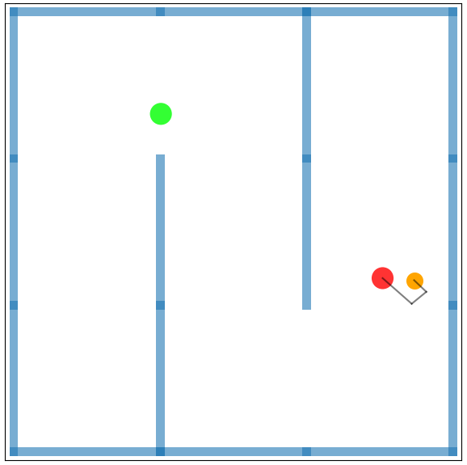
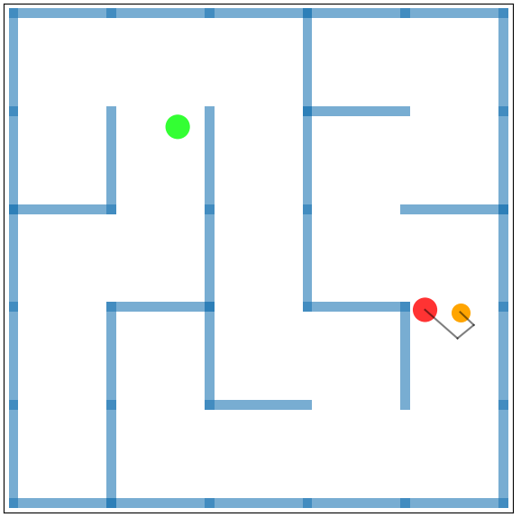
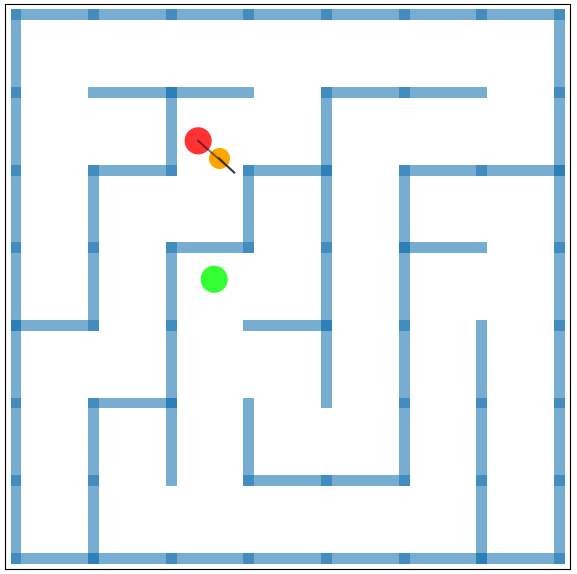
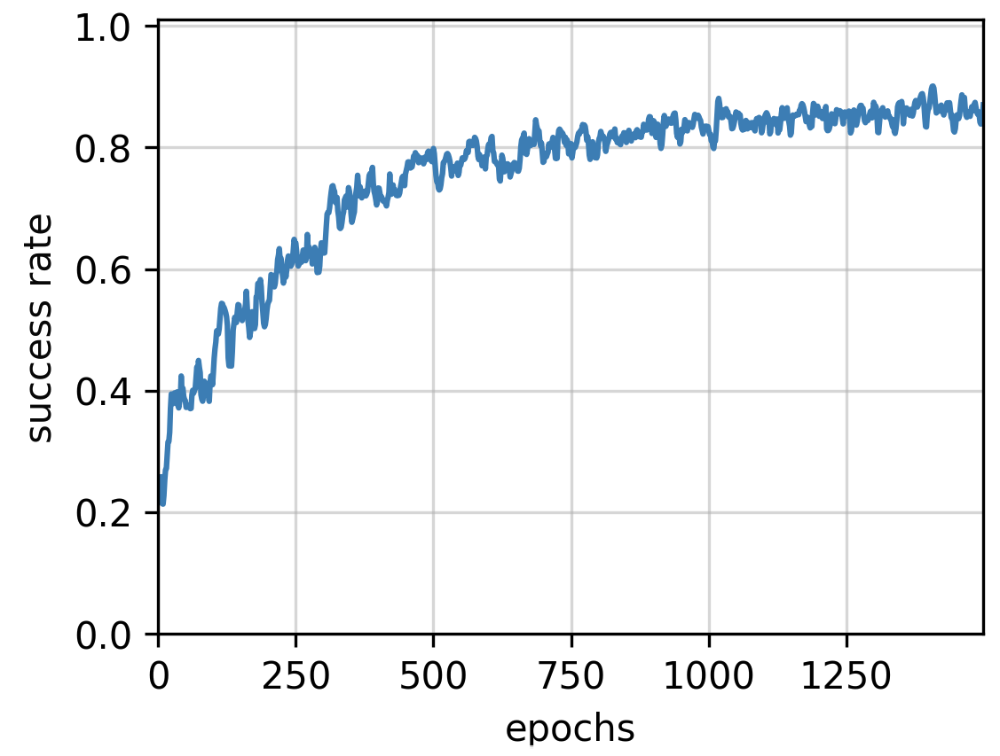
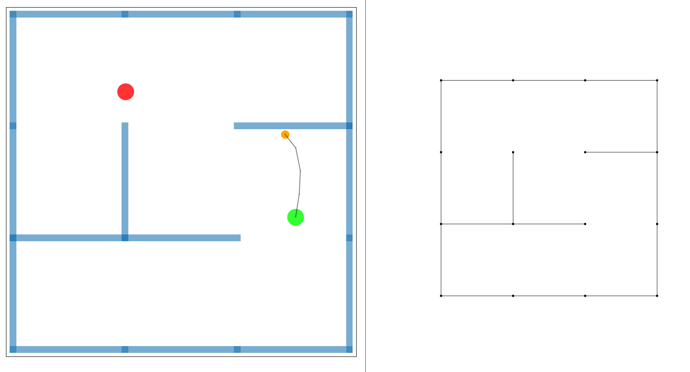

# Learning Obstacle Representations for Neural Motion Planning

Robin Strudel, Ricardo Garcia, Justin Carpentier, Jean-Paul Laumond, Ivan Laptev, Cordelia Schmid\
CoRL 2020


- [Project Page](https://www.di.ens.fr/willow/research/nmp_repr/)
- [Paper](https://arxiv.org/abs/2008.11174)


### Table of Content

- [Setup](#setup)
- [Training](#train)
- [Run](#run)
- [Logging](#logging)
- [Cite](#cite)


## Setup

Download the code and switch to `recvis20` branch
```
git clone https://github.com/rstrudel/nmprepr
cd nmprepr
git checkout recvis20
```

To create a new conda environment containing dependencies
```
conda env create -f environment.yml
conda activate nmprepr
```

To update a conda environment with dependencies
```
conda env update -f environment.yml
```

## Train

### Maze

To train a planning policy on maze environments generated by a 3x3 grid
```
python -m nmp.train Maze-Simple-v0 maze_baseline --horizon 75 --seed 0 --epochs 1500
```

For 5x5 grids use `Maze-Medium-v0` and for 7x7 grid use `Maze-Hard-v0`.
<p float="center">
    
    
    
</p>

Note that the mazes are randomly generated. At each episode the agent has to solve a problem with a different maze.

### Results

On `Maze-Simple-v0` you should get a success rate similiar to the curve below:




### Monitor

You can monitor experiments with
```
tensorboard --logdir=/path/to/experiment
```

## Run

Run a planning policy and visualize it with
```
python -m nmp.run Maze-Simple-v0 --exp-name log_dir/params.pkl --seed 100 --horizon 75
```
       
Evaluate the success rate of a policy on 100 episodes
```
python -m nmp.run Maze-Simple-v0 --exp-name log_dir/params.pkl --seed 100 --horizon 75 --episodes 100
```

## Observation

A maze is represented by a set of edges (x1, y1, x2, y2) which are passed through PointNet.
The edge set and goals are centered with respect to the agent current position. You can see below on the left an example of an environment and on the right its representation:



## Logging

By default the checkpointing will be in your home directory. You can change it by defining a `CHECKPOINT` environment variable. Add the following to your `.bashrc` file to change the logging directory.
```
export CHECKPOINT=/path/to/checkpoints
```

## Cite

Please cite our work if you use our code or compare to our approach
```
@inproceedings{strudelnmp2020,
title={Learning Obstacle Representations for Neural Motion Planning},
author={R. {Strudel} and R. {Garcia} and J. {Carpentier} and J.P. {Laumond} and I. {Laptev} and C. {Schmid}},
journal={Proceedings of Conference on Robot Learning (CoRL)},
year={2020}
}
```
