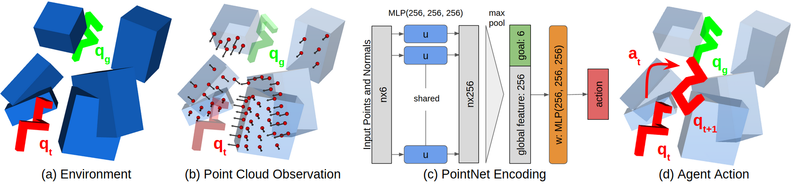
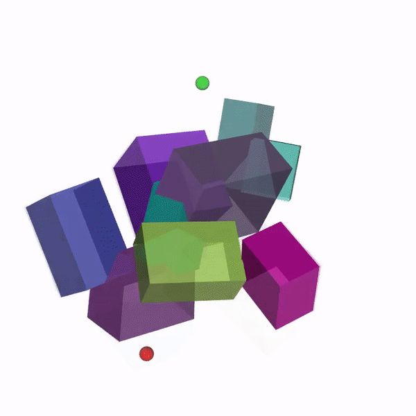

# Learning Obstacle Representations for Neural Motion Planning

Robin Strudel, Ricardo Garcia, Justin Carpentier, Jean-Paul Laumond, Ivan Laptev, Cordelia Schmid\
CoRL 2020




- [Project Page](https://www.di.ens.fr/willow/research/nmp_repr/)
- [Paper](https://arxiv.org/abs/2008.11174)


### Table of Content

- [Cite](#cite)
- [Setup](#setup)
- [Training](#training)
  - [Train on narrow passages](#narrow-passages)
  - [Train on 3D environments](#3d-environments)
  - [Monitor experiments](#monitor)
- [Run](#run)
- [Logging](#logging)

## Cite

Please cite our work if you use our code or compare to our approach
```
@inproceedings{strudelnmp2020,
title={Learning Obstacle Representations for Neural Motion Planning},
author={R. {Strudel} and R. {Garcia} and J. {Carpentier} and J.P. {Laumond} and I. {Laptev} and C. {Schmid}},
journal={Proceedings of Conference on Robot Learning (CoRL)},
year={2020}
}
```

## Setup

Download the code
```
git clone https://github.com/rstrudel/nmprepr
cd nmprepr
```

To create a new conda environment containing dependencies
```
conda env create -f environment.yml
conda activate nmprepr
```

To update a conda environment with dependencies
```
conda env update -f environment.yml
```

## Train

### Narrow passages

To train a planning policy on 2D environments with narrow passages
```
python -m nmp.train Narrow-64Pts-LocalSurfaceNormals-v0 narrow --horizon 50 --seed 0
```

### 3D environments

To train a planning policy for the Sphere
```
python -m nmp.train Sphere-Boxes-64Pts-Rays-v0 sphere_boxes --horizon 80 --seed 0
```

To train planning policies for the S-Shape
```
python -m nmp.train SShape-Boxes-64Pts-Rays-v0 sshape_boxes --horizon 80 --seed 0
```

### Monitor

You can monitor experiments with
```
tensorboard --logdir=/path/to/experiment
```

## Run

Launch gepetto-gui in a separate terminal
```
gepetto-gui
```

Run a planning policy for the S-Shape and visualize it with gepetto-gui
```
python -m nmp.run SShape-Boxes-64Pts-Rays-v0 --exp-name log_dir/params.pkl --seed 100 --horizon 80
```
       


Evaluate the success rate of a policy on 100 episodes
```
python -m nmp.run SShape-Boxes-64Pts-Rays-v0 --exp-name log_dir/params.pkl --seed 100 --horizon 80 --episodes 100
```


## Logging

By default the checkpointing will be in your home directory. You can change it by defining a `CHECKPOINT` environment variable. Add the following to your `.bashrc` file to change the logging directory.
```
export CHECKPOINT=/path/to/checkpoints
```
